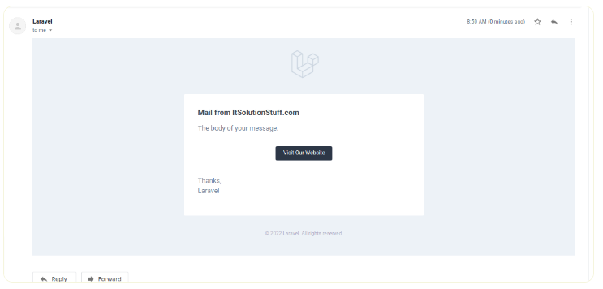

# laravel9_markdown_laravel9_send_email_using_markdown
# laravel9_react_js_auth_scaffolding
## 1. Install Laravel 9
```Dockerfile
composer create-project laravel/laravel laravel9_markdown_laravel9_send_email_using_markdown
```
## 2. Make Configuration
- Vào .env
```Dockerfile
MAIL_MAILER=smtp
MAIL_HOST=smtp.gmail.com
MAIL_PORT=465
MAIL_USERNAME=mygoogle@gmail.com
MAIL_PASSWORD=rrnnucvnqlbsl
MAIL_ENCRYPTION=tls
MAIL_FROM_ADDRESS=mygoogle@gmail.com
MAIL_FROM_NAME="${APP_NAME}"

MAIL_MAILER=smtp
MAIL_HOST=smtp.gmail.com
MAIL_PORT=587
MAIL_USERNAME=1812767@dlu.edu.vn
MAIL_PASSWORD=Bichhien2612
MAIL_ENCRYPTION=tls
MAIL_FROM_ADDRESS=1812767@dlu.edu.vn
MAIL_FROM_NAME="${APP_NAME}"
```
## 3/. Create Mailable Class with Markdown
```Dockerfile
php artisan make:mail MyDemoMail --markdown=emails.myDemoMail
```
- Vào app/Mail/MyDemoMail.php
```Dockerfile
<?php
  
namespace App\Mail;
  
use Illuminate\Bus\Queueable;
use Illuminate\Contracts\Queue\ShouldQueue;
use Illuminate\Mail\Mailable;
use Illuminate\Queue\SerializesModels;
  
class MyDemoMail extends Mailable
{
    use Queueable, SerializesModels;
  
    public $mailData;
  
    /**
     * Create a new message instance.
     *
     * @return void
     */
    public function __construct($mailData)
    {
        $this->mailData = $mailData;
    }
  
    /**
     * Build the message.
     *
     * @return $this
     */
    public function build()
    {
        return $this->subject('Mail from ItSolutionStuff.com')
                    ->markdown('emails.myDemoMail');
    }
}
```
## 4. Create Controller
```Dockerfile
php artisan make:controller MailController
```
- Vào app/Http/Controllers/MailController.php
```Dockerfile
<?php
  
namespace App\Http\Controllers;
   
use Illuminate\Http\Request;
use Mail;
use App\Mail\MyDemoMail;
  
class MailController extends Controller
{
    /**
     * Write code on Method
     *
     * @return response()
     */
    public function index()
    {
        $mailData = [
            'title' => 'Mail from ItSolutionStuff.com',
            'url' => 'https://www.itsolutionstuff.com'
        ];
         
        Mail::to('to_your_email@gmail.com')->send(new MyDemoMail($mailData));
         
        dd("Email is sent successfully.");
    }
}
```
## 5. Create Routes
- Vào routes/web.php
```Dockerfile
<?php
  
use Illuminate\Support\Facades\Route;
  
use App\Http\Controllers\MailController;
  
/*
|--------------------------------------------------------------------------
| Web Routes
|--------------------------------------------------------------------------
|
| Here is where you can register web routes for your application. These
| routes are loaded by the RouteServiceProvider within a group which
| contains the "web" middleware group. Now create something great!
|
*/
  
Route::get('send-mail', [MailController::class, 'index']);
```
## 6. Create Blade View
- Vào resources/views/emails/demoMail.blade.php
```Dockerfile
@component('mail::message')
# {{ $mailData['title'] }}
  
The body of your message.
  
@component('mail::button', ['url' => $mailData['url']])
Visit Our Website
@endcomponent
  
Thanks,

{{ config('app.name') }}
@endcomponent
```
## 7. Run Laravel App:
```Dockerfile
php artisan serve
```
- Vào http://localhost:8000/send-mail

Output:


